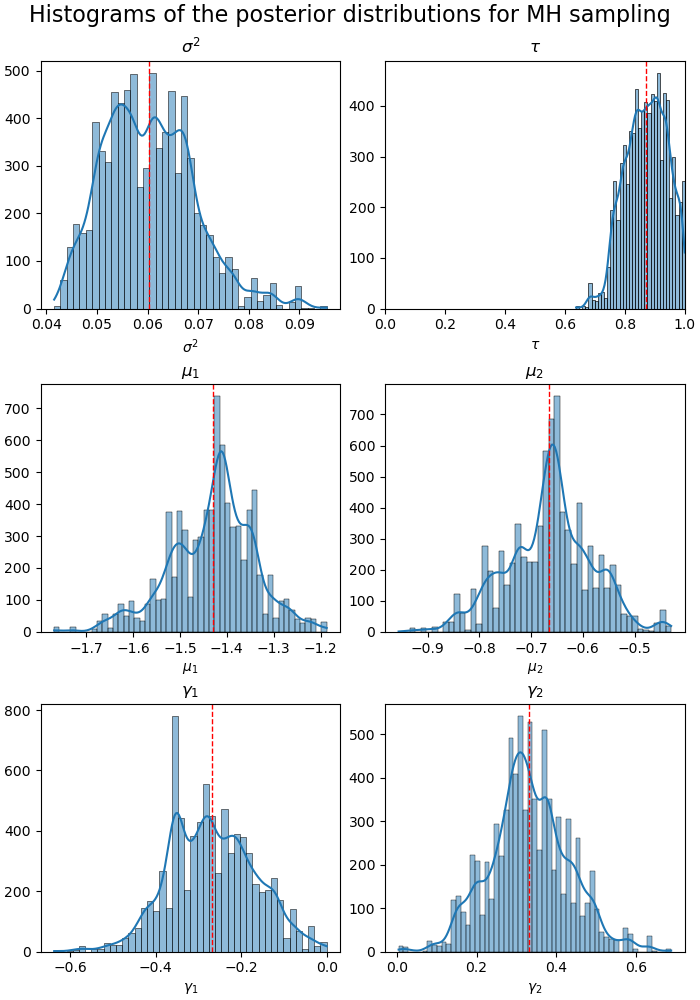
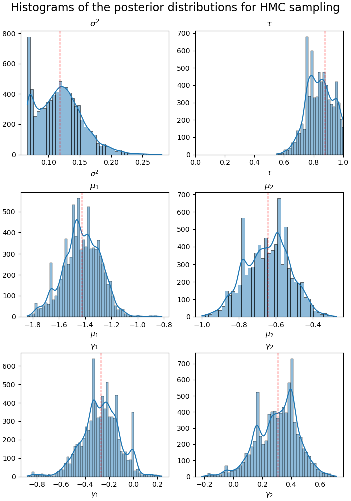
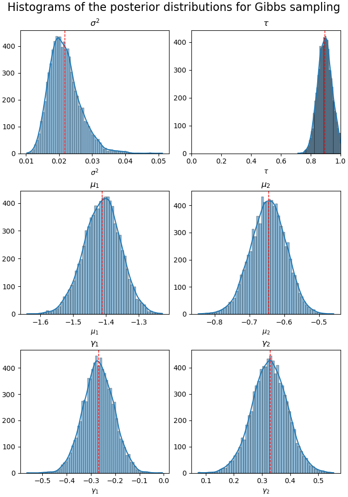

# STATS 270 Project

# Egor Lappo

In this report, I discuss choices made in implementing sampling approaches and present the results. Then, I discuss how they compare to each other. Lastly, I provide an appendix with calculations. The code is available on Github at [https://github.com/EgorLappo/STATS270_project](https://github.com/EgorLappo/STATS270_project).

## Metropolis-Hastings 

This was the most straightforward approach. I chose the following proposal distributions. For $\tau$, I chose $\text{Uniform}(0,1)$; for $\mu_i$, $\gamma_i$, I chose $N(\mu_i, 0.5)$ and $N(\gamma_i,0.5)$ respectively; for $\sigma^2$ I chose $N(\sigma^2, 0.1)$ constrained to $[0,10]$. These are reasonably efficient in their exploration of the probability space, and I've seen them being used in practice. 

My program prints out the posterior means, together with a posterior confidence interval that ranges from $0.05$th to $0.95$th quantiles. Here is the output from $8000$ samples with $1000$ burn-in steps:

```
MH results:
s: 0.060 [0.048, 0.076]
tau: 0.872 [0.758, 0.981]
mu1: -1.430 [-1.603, -1.285]
mu2: -0.665 [-0.808, -0.533]
gamma1: -0.268 [-0.427, -0.101]
gamma2: 0.332 [0.167, 0.494]
```

I also produced histograms for posterior distributions of the parameters, with the posterior mean shown as a red line.




## Hamiltonian Monte-Carlo

I follow the method defined in lecture (and on Wikipedia) verbatim, by solving the Hamiltonian equations using the leapfrog integrator to generate a proposal. I chose the mass matrix to be the identity matrix. The other two parameters I needed to choose were the number of leapfrog steps $L$, and the time to integrate the trajectory for at each leapfrog step, $\Delta t$. If $\Delta t$ is too big, the algorithm is imprecise, for example, the proposals for $\tau$ would be out of the range $[0,1]$ and they will actualy be accepted often. If $L$ and $\Delta t$ are too small, there would be no benefit to HMC, the behavior would be as if I have MH sampling with proposals from the multivariate normal (leapfrog trajectories are approximately linear at short timescales). The computations related to leapfrog integration are presented in the appendix.

After fine-tuning, I set $L = 3$, $\Delta t=  0.01$. For example, if $\Delta t$ was too small, I observed that the distributions of HMC samples became highly multimodal with samplng concentrated in "unreasonable" ranges (judging by the other three methods). Of course, in modern algorithms these values are adjusted as the sampling progresses, but since the posterior is not too complex in our case, these parameters work okay. 

My program prints out the posterior means, together with a posterior confidence interval that ranges from $0.05$th to $0.95$th quantiles. Here is the output from $8000$ samples with $1000$ burn-in steps:

```
HMC results:
s: 0.119 [0.068, 0.180]
tau: 0.877 [0.702, 1.097]
mu1: -1.426 [-1.661, -1.206]
mu2: -0.645 [-0.849, -0.451]
gamma1: -0.269 [-0.534, 0.001]
gamma2: 0.307 [0.069, 0.519]
```

I also produced histograms for posterior distributions of the parameters, with the posterior mean shown as a red line.



## Importance Sampling

In the importance sampling approach is the most free-form, since potentialy I can choose any trial density to generate samples from. However, the variance of samples may be unreasonably high. It may be good to use some information in the data to fine-tune the process. One suggestion was to sample from an "arbitrary" distribution to generate an intermediate posterior, and then sample more from this new distribution.

I, however, used an approach similar to what was described in class. I computed the sample means and variances in the first and second groups to obtain MLE estimates of $\mu_1$, $\mu_2$, $\gamma_1$, $\gamma_2$, and $\sigma^2$. Then, I selected the trial distributions "around" these values. In particular, I sampled $\mu_1$ from $N(-1.5,1.5)$, $\mu_2$ from $N(-0.5,1.5)$, $\gamma_1$ from $N(-0.3,1.5)$, and $\gamma_2$ from $N(0.3,1.5)$. I chose to set large variance here to be sure that I get a good sample even if my selection of the mean is poor. For $\tau$, I sample from $\text{Uniform}(0,1)$, and $\sigma^2$ is sampled from $\text{Exp}(12)$, since it has to be nonnegative.

Using IS, I compute posterior means of each of the parameters. Here is the output from performing $10,000$ samples:

```
importance sampling results:
s: 0.06752762424017646
tau: 0.7985676374572556
mu1: -1.3697157543322087
mu2: -0.8307951139998062
gamma1: -0.1865337808713366
gamma2: 0.6806709573240564
```

## Gibbs Sampling

For Gibbs Sampling, I have used the "linear scan" version of the approach, in which I sample each parameter conditional on "current" values of other parameters in the same order in each iteration. The computations of conditional distributions are presented in the appendix. There was little freedom for choice here, except for the starting values for sampling. I chose an approach similar to importance sampling, selecting initial parameter values to be close to "estimates" that I've obtained from other methods. Also, since $\mu_1$ is conditionally independent of $\mu_2$ (same for $\gamma_k$'s), it can be said that I do a "block" update of these parameters, sampling from the two conditional distributions at the same time.

My program prints out the posterior means, together with a posterior confidence interval that ranges from $0.05$th to $0.95$th quantiles. Here is the output from $8000$ samples with $1000$ burn-in steps:

```
Gibbs sampler results:
s: 0.022 [0.015, 0.030]
tau: 0.894 [0.817, 0.973]
mu1: -1.412 [-1.506, -1.322]
mu2: -0.646 [-0.730, -0.565]
gamma1: -0.269 [-0.373, -0.165]
gamma2: 0.327 [0.222, 0.431]
```

I also produced histograms for posterior distributions of the parameters, with the posterior mean shown as a red line.



## Discussion

Overall, judging by the histograms and the produced point estimates, all methods have a very similar performance, with several interesting exceptions. For example, the Gibbs sampler seems to underestimate the variance, while HMC overestimates it. Similaly, importance sampling overestimated the value of $\gamma_2$. The samples from the posterior are "nice" in all three Markov chain based methods: they are approximately unimodal and even approximately symmetric for $\mu_k$ and $\gamma_k$. In my opinion, the Gibbs sampler has shown the best performance: as all except one of the conditional distributions were normal, there is no question about whether posterior mean is a good characterization of the parameter estimate.

As the sample size of the method increases, all methods require more computational time: at each step, all of them either recalculate the likelihood or make some other repetitive computations. Gibbs sampling was the fastest since all that was needed were the parameters for conditional distributions, requiring less mathematical operations. HMC requires the most computational time, especialy with multiple leapfrog steps per iteration. However, as the HMC approach is able to more efficiently explore the distribution, there is no need for excessive sample sizes given well-adjusted hyperparameters. 

This project was written in Rust, and the source code is available at [https://github.com/EgorLappo/STATS270_project](https://github.com/EgorLappo/STATS270_project).


## Appendix 

The distribution that I want to sample is 

\begin{align*} 
    p(\theta\mid x) & =  \frac{1}{\sigma^2} \frac{1}{(2\pi\sigma^2)^N} e^{-\frac{1}{2\sigma^2}\sum_{i_1}(x_{i_11}-\mu_1)^2} e^{-\frac{1}{2\sigma^2}\sum_{i_1}(x_{i_12}-\mu_2)^2} \\
    & \times e^{-\frac{1}{2\sigma^2}\sum_{i_2}(x_{i_21}-\gamma_1)^2} e^{-\frac{1}{2\sigma^2}\sum_{i_2}(x_{i_22}-\gamma_2)^2} \\
    & \times e^{-\frac{1}{2\sigma^2}\sum_{i_3}(x_{i_31}-\mu_1/2-\gamma_1/2)^2} e^{-\frac{1}{2\sigma^2}\sum_{i_3}(x_{i_32}-\mu_1/2-\gamma_2)^2} \\ 
    & \times e^{-\frac{1}{2\sigma^2}\sum_{i_4}(x_{i_41}-\tau mu_1- (1-\tau) \gamma_1)^2} e^{-\frac{1}{2\sigma^2}\sum_{i_4}(x_{i_42}-\tau \mu_1 - (1-\tau)\gamma_2)^2},
\end{align*}

where $\theta=(\sigma^2, \tau, \mu_1, \mu2, \gamma_1, \gamma_2)$ are the parameters, $N$ is the total number of observations, and $i_k$ indexes data points in $k$th group.

For the Hamiltonian Monte Carlo, I set $U(\theta) = -\log p(\theta\mid x)$, so that 

\begin{align*}
    U(\theta) & = N\log 2\pi +  (N+1) \log \sigma^2 \\
    & + \frac{1}{2\sigma^2}\Bigg[\sum_{i_1}(x_{i_11}-\mu_1)^2 + \sum_{i_1}(x_{i_12}-\mu_2)^2 \\
    & + (x_{i_21}-\gamma_1)^2 + (x_{i_22}-\gamma_2)^2 \\ 
    & + (x_{i_31}-\mu_1/2-\gamma_1/2)^2 + (x_{i_32}-\mu_1/2-\gamma_2)^2 \\
    & + (x_{i_41}-\tau mu_1- (1-\tau) \gamma_1)^2 + (x_{i_42}-\tau \mu_1 - (1-\tau)\gamma_2)^2\Bigg].
\end{align*}

I compute the partial derivatives of $U$.

\begin{align*}
    \frac{\partial U}{\partial \sigma^2} & = \frac{N+1}{\sigma^2} - \sum_{i_1} \frac{(x_{i_11} - \mu_1)^2}{2(\sigma^2)^2} - \sum_{i_1} \frac{(x_{i_12} - \mu_2)^2}{2(\sigma^2)^2} \\
    & - \sum_{i_2} \frac{(x_{i_21} - \gamma_1)^2}{2(\sigma^2)^2} - \sum_{i_2} \frac{(x_{i_22} - \gamma_2)^2}{2(\sigma^2)^2} \\
    & - \sum_{i_3} \frac{(x_{i_31} - \mu_1/2 - \gamma_1/2)^2}{2(\sigma^2)^2} - \sum_{i_3} \frac{(x_{i_32} - \mu_2/2-\gamma_2/2)^2}{2(\sigma^2)^2} \\
    & - \sum_{i_4} \frac{(x_{i_41} - \tau\mu_1 - (1-\tau)\gamma_1)^2}{2(\sigma^2)^2} - \sum_{i_4} \frac{(x_{i_42} - \tau\mu_2 - (1-\tau)\gamma_2)^2}{2(\sigma^2)^2} \\
\end{align*}


$$
\frac{\partial U}{\partial \tau} = \frac{1}{\sigma^2} \sum_{i_4} \left[(\gamma_1- \mu_1) (x_{i_41} - \tau\mu_1 - (1-\tau)\gamma_1) + (\gamma_2-\mu_2) (x_{i_42} - \tau\mu_2 - (1-\tau)\gamma_2)\right]
$$

\begin{align*}
\frac{\partial U}{\partial \mu_k} & = - \sum_{i_1} \frac{(x_{i_1k} - \mu_k)}{\sigma^2} \\
& - \sum_{i_3} \frac{(x_{i_3k} - \mu_k/2 - \gamma_k/2)}{2\sigma^2} \\
& - \tau \sum_{i_4} \frac{(x_{i_4k} - \tau \mu_k - (1-\tau) \gamma_k)}{\sigma^2}
\end{align*}

\begin{align*}
\frac{\partial U}{\partial \gamma_k} = & - \sum_{i_2} \frac{(x_{i_2k} - \gamma_k)}{\sigma^2} \\
& - \sum_{i_3} \frac{(x_{i_3k} - \mu_k/2 - \gamma_k/2)}{2\sigma^2} \\
& - (1-\tau) \sum_{i_4} \frac{(x_{i_4k} - \tau \mu_k - (1-\tau) \gamma_k)}{\sigma^2}
\end{align*}

Then, I use this in the leapfrog integrator.

For Gibbs sampling, I compute the conditional distributions. The easiest one is the distribution for $\sigma^2$. Since the numerator in the exponential is "fixed" (conditioned upon), I know that 

$$
p(\sigma^2 \mid \tau, \mu_i, \gamma_i, x) \propto \text{Inv-}\chi^2(\nu),
$$

where $\nu = 2N$.

For $\mu_k$, I am working with the density 

\begin{align*}
p(\mu_k \mid \tau, \sigma^2, \ldots, \ x) & \propto \exp\frac{-1}{2\sigma^2} \left[\sum (x_{i_1k}- \mu_k)^2 + \sum (x_{i_3k}- \mu_k/2 - \gamma_k/2)^2 + \sum (x_{i_4k}- \tau\mu_k-(1-\tau)\gamma_k)^2\right] \\
& \propto \exp\frac{-1}{2\sigma^2} \left[n_1(\bar x_{1k}- \mu_k)^2 + n_3(\bar x_{3k}- \mu_k/2 - \gamma_k/2)^2 + n_4 (\bar x_{4k}- \tau\mu_k-(1-\tau)\gamma_k)^2\right] \\
& \sim N\left(\frac{n_1 \bar x_{1k} + n_3(2\bar x_{3k}-\gamma_k)/4 + \tau n_4 (\bar x_{4k} - (1-\tau) \gamma_k)}{n_1 + n_3/4 + \tau^2 n_4}, \frac{\sigma^2}{n_1 + n_3/4 + \tau^2 n_4}\right)
\end{align*}

where $n_j$ is the size of group $j$, and $\bar x_{jk}$ is the mean of $k$th variable in group $j$. In the calculation I omit the constant factors, which in our care are summands in the exponential that do not depend on $\mu_k$. The general fact that I used is that I can complete the square like

$$
    \exp\sum a_i(b_i - \mu)^2 \to \exp\left[\left(\sum a_i \right) \left(\mu - \frac{\sum a_i b_i}{\sum a_i}\right)^2\right].
$$

The derivation is almost equivalent for $\gamma_i$, but there instead I get 

\begin{multline*}
p(\gamma_k\mid \tau, \sigma^2, \ldots, x) \\ \sim N\left(\frac{n_2\bar x_{2k} + n_3(2\bar x_{3k}-\mu_k)/4 + (1-\tau) n_4 [\bar x_{4k} - \tau \mu_k]}{n_2+n_3/4+(1-\tau)^2 n_4}, \frac{\sigma^2}{n_2+n_3/4+(1-\tau)^2 n_4}\right).
\end{multline*}

Finally, for $\tau$ I get

\begin{align*}
p(\tau \mid \sigma^2, \ldots, x) & \propto \exp\frac{-1}{2\sigma^2}\left[\sum_{i_4,k}(x_{i_4k}- \tau\mu_k-(1-\tau)\gamma_k)^2\right] \\
& \propto \exp\frac{-1}{2(\sigma^2/n_4)}\left[\sum_{k}(\bar x_{4k}- \tau\mu_k-(1-\tau)\gamma_k)^2\right] \\
& \sim N\left(\frac{n_4(\mu_1-\gamma_2)(\bar x_{41} - \gamma_1) + n_4(\mu_2 - \gamma_2)(\bar x_{42} - \gamma_2)}{n_4(\mu_1-\gamma_2)^2 + n_4(\mu_2 - \gamma_2)^2}, \frac{\sigma^2}{n_4(\mu_1-\gamma_2)^2 + n_4(\mu_2 - \gamma_2)^2}\right)
\end{align*}

however, I have to constrain this distribution to be within $[0,1]$ by rejecting samples outside the range.